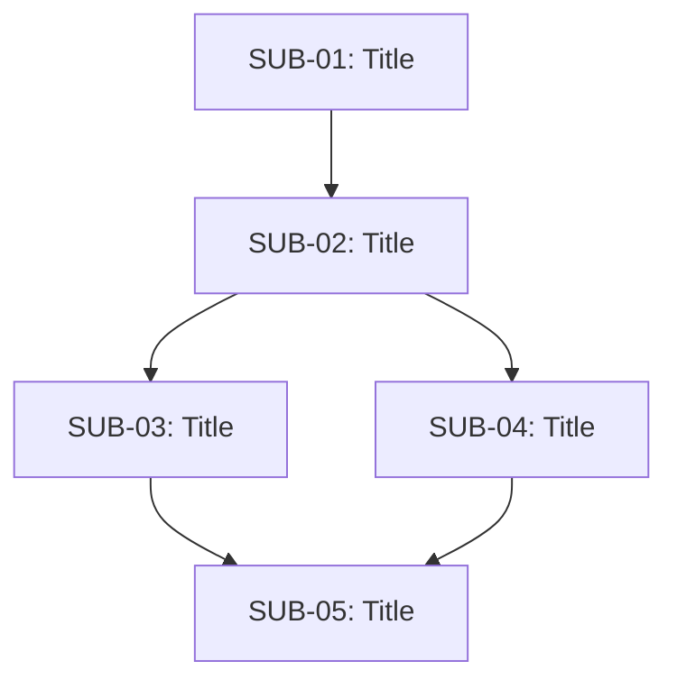

# Subtask List

> **Purpose**: Master list of all subtasks for the current task/sprint.
> **Update When**: New subtasks identified, subtasks completed, or priorities change.
> **Agent Instructions**:
> - Break down large tasks into manageable subtasks
> - Keep this synchronized with active_subtask.md
> - Mark completed subtasks but keep visible for context
> - Reorder based on dependencies and priorities

## Parent Task Overview

**Task ID**: [TASK-XXX]
**Title**: [Main task title]
**Goal**: [What we're trying to achieve]
**Status**: =â Active / =á In Progress / =4 Blocked /  Completed
**Started**: [Date]
**Target Completion**: [Date]

---

## Subtask Breakdown

### Priority 1 - Must Complete

#### [SUB-01] [Subtask Title] 
**Status**: Completed
**Completed**: [Date]
**Time Spent**: [Estimate]
**Description**: [Brief description]
**Outcome**: [What was accomplished]

#### [SUB-02] [Subtask Title] =
**Status**: In Progress (ACTIVE)
**Started**: [Date]
**Assigned**: [Agent/Human]
**Dependencies**: [SUB-01]
**Description**: [Brief description]
**Blocker**: [If any]

#### [SUB-03] [Subtask Title] ó
**Status**: Pending
**Dependencies**: [SUB-02]
**Estimated Effort**: [Small/Medium/Large]
**Description**: [Brief description]

### Priority 2 - Should Complete

#### [SUB-04] [Subtask Title] ó
**Status**: Pending
**Dependencies**: None
**Estimated Effort**: [Small/Medium/Large]
**Description**: [Brief description]

### Priority 3 - Nice to Have

#### [SUB-05] [Subtask Title] ó
**Status**: Pending
**Dependencies**: [SUB-03, SUB-04]
**Description**: [Brief description]

---

## Subtask Dependencies



[Or text format:]
```
SUB-01 ’ SUB-02 ’ SUB-03 ’ SUB-05
              ’ SUB-04 ’
```

---

## Progress Summary

**Total Subtasks**: [Count]
**Completed**: [Count] ([Percentage]%)
**In Progress**: [Count]
**Pending**: [Count]
**Blocked**: [Count]

**Velocity**: [Subtasks per day/session]
**Estimated Remaining Time**: [Estimate]

---

## Completed Subtasks Archive

### [SUB-XX] [Title] 
**Completed**: [Date]
**Summary**: [What was done]
**Files**: `path/to/file.ext`

---

## Template for New Subtask
```markdown
#### [SUB-XX] [Subtask Title] ó
**Status**: Pending / In Progress / Blocked / Completed
**Dependencies**: [SUB-XX] or None
**Estimated Effort**: Small/Medium/Large
**Description**: [What needs to be done]
**Acceptance Criteria**:
- [ ] Criterion 1
- [ ] Criterion 2
**Files Involved**:
- path/to/file.ext
```

---

## Legend

- ó Pending
- = In Progress
- =4 Blocked
-  Completed
- =â On Track
- =á At Risk
- =: High Priority

---
*Last Updated: [Date] | Updated By: [Agent/Human name]*
*Current Active: [SUB-XX] | Overall Progress: [XX]%*
